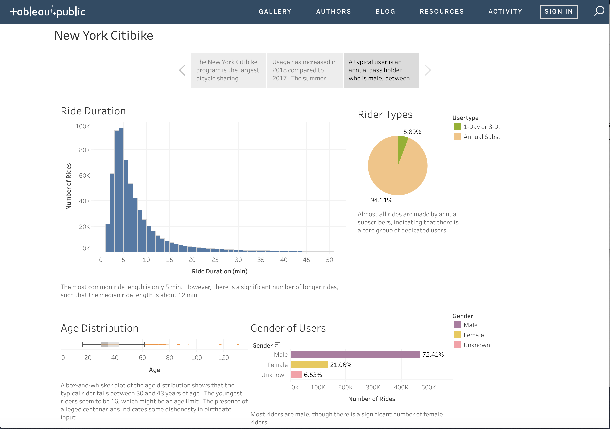

# New-York-CitiBike
An analysis of public bike-sharing ride data for New York City

### Description
The [New York Citibike](https://www.citibikenyc.com/) is the largest bike-sharing program in the country.  They provide individual ride [data](https://www.citibikenyc.com/system-data) for developers, but do not provide much analysis graph wise themselves.

To that end, a visual dashboard using Tableau Public was [created](https://public.tableau.com/profile/eric.hagee#!/vizhome/NewYorkCitibike/Story1?publish=yes).

### Data and methodology
For relevance, data from 2017 and 2018 was analyzed.  This is provided in zip files on the Citibike website.  The unzipped files are available in the data folder.

For some preprocessing, and to combine all data together, a Jupyter notebook is used.  The exploration and preprocessing steps can be seen in the data cleaning folder.

The processed data is in the processed data folder, but combining all 24 months creates a csv file that is too large to put in Github (over 100 MB).  It can, however, be created with the Jupyter Notebook.  As well, it is included in a zip file.

### Summary of Findings
From the data provided, it appears that the most usage actually occurs in New Jersey.  The highest months of usage are in the summer and peak usage occurs daily around 8 AM and 6 PM.  Most rides are short (median 12 minutes).  Most users are male, between 30 to 43, and annual pass holders.

### File Structure
 - The data folder contains the 24 csv files downloaded from the Citibike website.
 - The data cleaning folder contains a Jupyter notebook that contains the data preprocessing and combining for usage in Tableau Public.
 - The processed data folder contains the csv files produced from the Jupyter notebook for usage in Tableau public.
 - The images folder has the screenshot above.
 - The Tableau Public workbook (New York Citibike.twbx) was downloaded and is provided here.
 - This file, README.md is the readme file.
